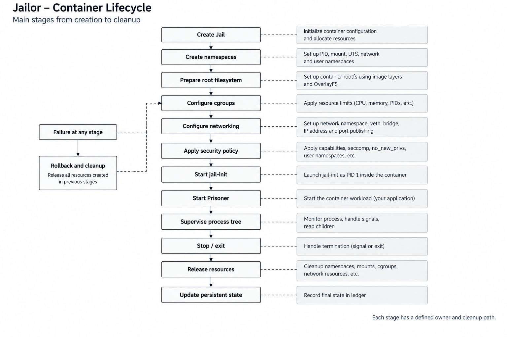

# Jailor

**A Linux container engine written in Go, built around the primitives
that make containers work.**

Jailor is a Linux-native container engine that provides process
isolation, resource control, filesystem isolation, networking, security
controls, image management, and container lifecycle management.

The project began as an exercise in understanding what happens
underneath a container. It has since grown into a complete runtime and
engine with its own process supervision, storage, networking, security,
image, state-management, and daemon layers.

The goal is not to wrap an existing container engine. It is to
understand the underlying Linux mechanisms and build the pieces into a
coherent system.

## Architecture

### High-level architecture

The Warden is the central engine. It coordinates the runtime, storage,
networking, security, image/registry, and persistent-state subsystems.


### Container runtime

A Jail is the isolated execution environment. `jail-init` acts as PID 1
inside it and supervises the Prisoner, while the Warden coordinates the
surrounding runtime configuration.


### Container lifecycle

Container creation is treated as a sequence of owned operations. If a
later stage fails, resources created by earlier stages are rolled back
and cleaned up.



## The Jailor model

Jailor uses a prison metaphor to describe the runtime architecture. The
terminology is architectural; the implementation continues to use
precise Linux terminology where appropriate.

  Jailor term      System concept
  ---------------- --------------------------------------
  **Warden**       Container engine and runtime manager
  **Jail**         Container
  **Prisoner**     Workload process
  **Bars**         Linux namespaces
  **Cell**         Container root filesystem
  **Rations**      cgroups and resource limits
  **Gate**         Container networking
  **Privileges**   Linux security controls
  **Sentence**     Process lifecycle
  **Ledger**       Persistent runtime state
  **Visitation**   `exec` / `attach`
  **Release**      Container teardown and cleanup

## What it provides

### Runtime and process management

Jailor uses Linux namespaces and a dedicated `jail-init` process to
isolate and supervise container workloads.

The runtime covers:

-   PID, mount, UTS, network, and user namespaces
-   process lifecycle management
-   PID 1 / `jail-init`
-   signal forwarding
-   child reaping
-   exit-status propagation
-   graceful shutdown and forced termination
-   explicit lifecycle state transitions
-   runtime recovery and cleanup

### Resource control

Linux cgroups are used for resource limits and accounting.

Current resource controls include:

-   CPU
-   memory
-   process count

Resource setup is part of container startup. A failed resource
configuration prevents the workload from starting instead of silently
running without the requested limit.

### Storage and filesystems

Jailor separates immutable image content from container-specific
writable state.

The storage subsystem provides:

-   content-addressed storage
-   digest verification
-   immutable layers
-   writable container layers
-   OverlayFS
-   read-only root filesystems
-   layer reference tracking
-   cleanup of unused content
-   crash-safe storage operations

### OCI images and registries

Jailor understands OCI image metadata and integrates image layers with
its storage engine.

Image operations include:

``` bash
jailor images
jailor inspect image IMAGE
jailor image tag SOURCE TARGET
jailor image rm IMAGE
jailor pull IMAGE
jailor push IMAGE
```

The image subsystem handles manifests, configuration, layers, content
verification, local reuse, registry authentication, transfers, and
retries.

### Networking

Container networking is built from Linux network namespaces and standard
Linux networking primitives.

The networking subsystem provides:

-   network namespaces
-   veth pairs
-   Linux bridges
-   IP address management
-   routing
-   DNS configuration
-   network isolation
-   port publishing
-   multiple networks
-   cleanup of network resources

Network management:

``` bash
jailor network create NAME
jailor network ls
jailor network inspect NAME
jailor network rm NAME
```

### Security

Security controls are applied as part of container startup rather than
treated as an afterthought.

Jailor supports:

-   Linux capabilities
-   capability allowlists and dropping
-   user namespaces
-   `no_new_privs`
-   seccomp
-   read-only root filesystems
-   mount restrictions
-   cgroup resource limits
-   optional AppArmor/SELinux integration where supported

A security operation that fails is treated as a startup failure. Jailor
does not silently claim that an unapplied security control is active.

### Rootless execution

Jailor supports rootless execution through Linux user namespaces and the
host's subordinate UID/GID configuration.

Rootless operation covers:

-   UID/GID namespaces
-   subordinate UID/GID mappings
-   capability handling
-   rootless filesystem setup
-   rootless networking
-   cgroup delegation where supported

On supported systems:

``` bash
jailor run IMAGE /bin/sh
```

Rootless support depends on the kernel and host configuration, and
unsupported environments are reported explicitly.

## Container lifecycle

A Jail follows an explicit lifecycle:

``` text
CREATED → STARTING → RUNNING → STOPPING → STOPPED → DELETED
```

Failures are represented explicitly rather than inferred from missing
processes or files.

The runtime coordinates:

1.  namespace creation
2.  root filesystem preparation
3.  cgroup configuration
4.  network configuration
5.  security policy application
6.  `jail-init` startup
7.  Prisoner startup
8.  process supervision
9.  resource cleanup
10. persistent-state updates

Every major stage has an owner and a cleanup path.

## Daemon and API

Long-running runtime management is handled by `jailord`.

``` text
jailor CLI
    |
Unix domain socket
    |
jailord
    |
Warden
    |
Runtime / Storage / Network / Security
```

The daemon provides:

-   centralized runtime ownership
-   persistent state recovery
-   versioned API boundaries
-   concurrent client handling
-   Unix socket access control
-   structured lifecycle events
-   graceful shutdown

The CLI acts as a client of the engine rather than maintaining a second
implementation of container lifecycle logic.

## Container management

Core lifecycle commands:

``` bash
jailor create
jailor run
jailor start
jailor stop
jailor restart
jailor kill
jailor rm
jailor ps
jailor inspect
jailor stats
jailor logs
jailor exec
jailor attach
```

## Persistent state

The Ledger records the state required to manage Jails and their
associated resources.

This includes relationships between:

-   containers
-   processes
-   filesystems
-   cgroups
-   networks
-   security configuration
-   images and storage

Persistent state is part of the runtime's correctness model and is used
to recover from interrupted operations and daemon restarts.

## Failure handling

Container startup is treated as a sequence of fallible operations:

``` text
namespaces
    ↓
filesystem
    ↓
cgroups
    ↓
network
    ↓
security
    ↓
process
```

A failure at any stage triggers rollback of resources created earlier in
the operation.

Failure testing covers namespace, mount, rootfs, cgroup, network,
security, storage, image, process, and daemon failures, along with
interrupted operations and concurrent lifecycle calls.

## Testing

Testing is part of the runtime design, not a final step.

The project includes coverage for:

-   unit behavior
-   Linux integration
-   namespace isolation
-   filesystem isolation
-   resource enforcement
-   networking
-   security boundaries
-   process lifecycle
-   failure rollback
-   crash recovery
-   concurrency
-   storage integrity
-   image handling
-   rootless execution
-   stress and soak workloads

Standard checks:

``` bash
go test ./...
go test -race ./...
go vet ./...
```

Stress and failure tests are used to detect process, goroutine,
file-descriptor, mount, network, cgroup, storage, and state leaks.

## OCI compatibility

Jailor uses OCI concepts at its interoperability boundary while keeping
its internal runtime model independent.

Supported OCI concepts include, where implemented:

-   process configuration
-   root filesystem
-   mounts
-   namespaces
-   capabilities
-   resources
-   hostname
-   UID/GID
-   environment
-   working directory
-   read-only root filesystem

Unsupported configuration is rejected explicitly rather than silently
ignored.

Jailor does not claim complete OCI runtime compatibility beyond the
features that are implemented and tested.

## Project structure

``` text
jailor/
├── cmd/
│   └── jailor/
├── internal/
│   ├── warden/
│   ├── jail/
│   ├── prisoner/
│   ├── jailinit/
│   ├── runtime/
│   ├── bars/
│   ├── cell/
│   ├── rations/
│   ├── gate/
│   ├── privileges/
│   ├── ledger/
│   ├── storage/
│   ├── image/
│   ├── network/
│   ├── security/
│   ├── daemon/
│   └── linux/
├── tests/
├── docs/
│   └── diagrams/
├── go.mod
├── go.sum
└── README.md
```

## Requirements

Jailor is Linux-specific.

A development environment needs:

-   Linux
-   Go
-   a kernel providing the namespaces, cgroups, filesystem, networking,
    and security features used by the runtime

Rootful integration tests may require `sudo`.

Rootless execution additionally requires the appropriate user namespace
and subordinate UID/GID configuration.

## Getting started

``` bash
git clone <repository-url>
cd jailor

go build ./...
go test ./...
```

For development validation:

``` bash
go test -race ./...
go vet ./...
```

Runtime commands that configure Linux namespaces, mounts, networking, or
cgroups may require elevated privileges depending on the host
configuration and whether rootless mode is being used.

## Design principles

**Understand the primitive.**\
Linux features should remain understandable at the code level. Jailor
avoids abstractions that hide the behavior that matters.

**Make ownership explicit.**\
Processes, mounts, cgroups, network interfaces, and storage objects need
clear owners and deterministic cleanup.

**Fail closed.**\
A failed isolation or security operation should prevent the workload
from starting rather than silently reducing its isolation.

**Keep immutable data immutable.**\
Image layers are shared and read-only; container changes belong to
container-specific writable layers.

**Make lifecycle state explicit.**\
Container state should be represented directly instead of inferred from
the existence of files or processes.

**Measure before optimizing.**\
Performance work should be driven by benchmarks and observed
bottlenecks.

**Use standards where they help.**\
OCI compatibility provides useful interoperability without dictating the
internal design of the engine.

## Scope

Jailor focuses on the Linux container-engine layer.

It is not intended to be:

-   a Kubernetes replacement
-   a container orchestration platform
-   a distributed scheduler
-   a Docker wrapper
-   a shell script around another container runtime

The project is primarily concerned with the systems underneath container
execution: isolation, resources, filesystems, networking, security,
storage, images, and lifecycle management.

## Current status

Jailor has progressed from a minimal Linux container runtime into a
broader container-engine implementation.

The completed system covers:

-   Linux namespaces
-   process isolation
-   cgroups
-   container filesystem management
-   PID 1 / `jail-init`
-   process supervision
-   container lifecycle management
-   persistent runtime state
-   content-addressed storage
-   OverlayFS-based container filesystems
-   OCI image handling
-   registry operations
-   Linux container networking
-   rootless execution
-   capabilities
-   seccomp
-   `no_new_privs`
-   daemon/API management
-   observability
-   failure recovery
-   OCI runtime concepts

Jailor remains Linux-specific, and its exact behavior depends on the
host kernel and configuration.

## Why build a container engine?

The interesting part of a container is not the command used to start it.
It is the machinery underneath:

How does a process become PID 1?

How does it receive a different view of the system?

How are resources enforced?

How is its filesystem assembled?

How is its network namespace connected?

How are privileges reduced?

What happens when setup fails halfway through?

What happens when the supervising process disappears?

Jailor is an attempt to answer those questions in working systems
software.

## License

See [LICENSE](LICENSE).
